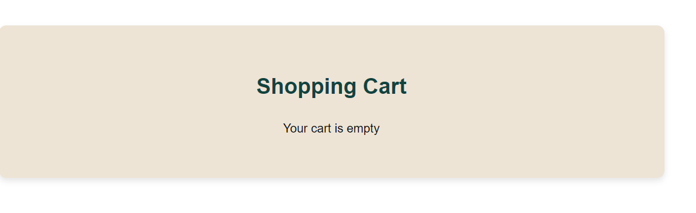
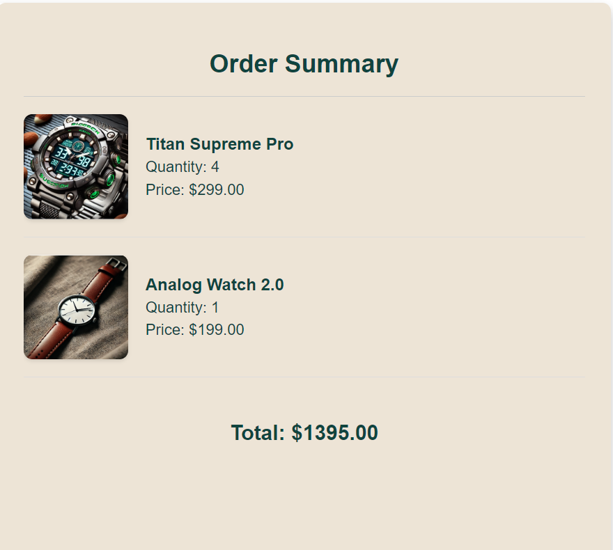
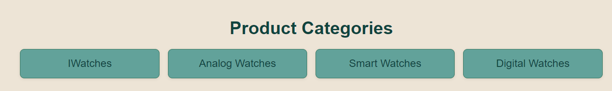
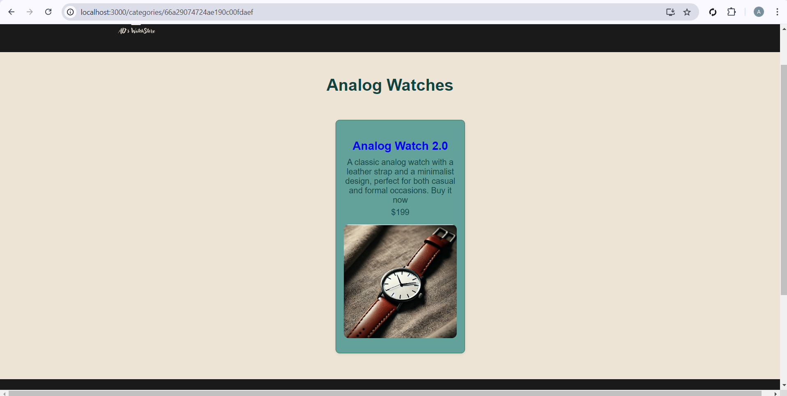
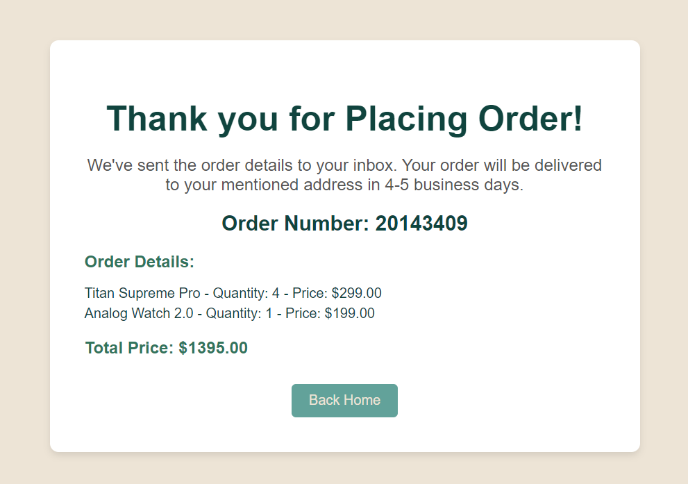
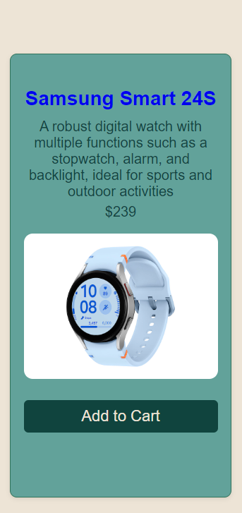
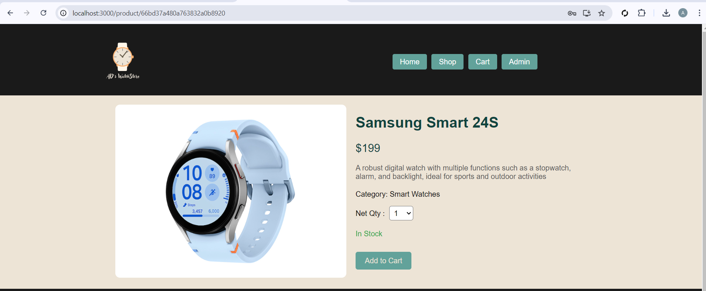
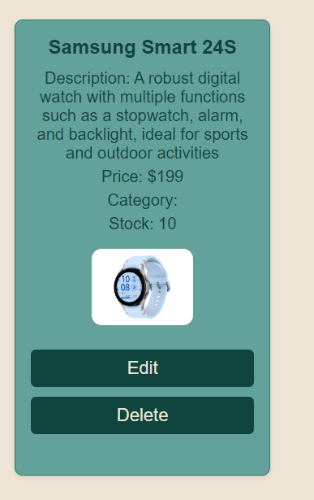

# **E-Commerce Project using MERN**

**Student Name:** Ankit Hiteshkumar Dave

**Student Number:** 8959634

**Date:** 07/19/2024

------------------------------------------------------------------------------------

# Technology Stack

**Frontend:** ReactJS  
**Backend:** Node.js with Express  
**Database:** MongoDB (Atlas)

-------------------------------------------------------------------------------------

# Database Schema Design

## Products Schema (MongoDB)
- `name: String`
- `description: String`
- `price: Number`
- `category: ObjectId`
- `stock: Number`
- `imageUrl: String`

## Categories Schema (MongoDB)
- `name: String`

-------------------------------------------------------------------------------------

# AD's WatchStore

AD's WatchStore is an e-commerce platform for browsing and purchasing watches. The project is built using React and includes various components for different pages and functionalities.

## Prerequisites

- Node.js
- npm
- MongoDB Atlas account

## Installation

1. Clone the repository:
   \`\`\`bash
   git clone https://github.com/ankitdave677/ecommerce-project
   \`\`\`
2. Navigate to the project directory:
   \`\`\`bash
   cd backend
   \`\`\`
   Navigate to the project directory:
   \`\`\`bash
   cd frontend
   \`\`\`
3. Install the dependencies in both the project directory:
   \`\`\`bash
   npm install
   \`\`\`

---------------------------------------------------------------------------------------------------------------------------------------

### Environment Variables

## Create a .env file in the backend directory and add the following environment variables:

\`\`\`
MONGO_URI=your_mongodb_atlas_connection_string
PORT=5000
\`\`\`

---------------------------------------------------------------------------------------------------------------------------------------

## Usage

1. Start the development server:
   \`\`\`bash
   npm start
   \`\`\`
2. Open your browser and go to \`http://localhost:3000\`.

---------------------------------------------------------------------------------------------------------------------------------------

### Frontend Structure

- \`HomePage.js\`: Displays the homepage of the watch store.
- \`CategoryPage.js\`: Displays a list of categories. Each category links to a list of products.
- \`ProductDetail.js\`: Displays detailed information about a specific product.
- \`ProductList.js\`: Displays a list of products in a selected category.
- \`Cart.js\`: Displays the items in the shopping cart.
- \`CheckoutPage.js\`: Displays the checkout form for users to enter their shipping and payment information.
- \`ThankYouPage.js\`: Displays an order confirmation message along with the order details.
- \`NavBar.js\`: Displays the navigation bar with links to Home, Shop, and Cart.
- \`Footer.js\`: Displays the footer of the website.
- \`AdminLogin.js\`: Allows admin to login using credentials.
- \`AdminDashboard.js\`: Admin can view, add, edit, and delete products and categories.

---------------------------------------------------------------------------------------------------------------------------------------

# Test Cases

### 1. Test Case: Display Products on Homepage

**Steps to Perform:**
1. Navigate to the homepage (`/`).
2. Observe the list of featured products.

**Expected Result:**
All featured products should be displayed on the homepage with their name, description, price, and image.

**Actual Result:**

---

### 2. Test Case: Add Product to Cart

**Steps to Perform:**
1. Navigate to the homepage.
2. Click on a product to view its details.
3. Click the "Add to Cart" button.

**Expected Result:**
The product should be added to the cart, and navigate directly to the Cart page.

**Actual Result:**

---

### 3. Test Case: Remove Product from Cart

**Steps to Perform:**
1. Add a product to the cart.
2. Navigate to the cart page (`/cart`).
3. Click the "Remove From Cart" button next to the product.

**Expected Result:**
The product should be removed from the cart, and the cart total should update accordingly.

**Actual Result:**

---

### 4. Test Case: Checkout Process

**Steps to Perform:**
1. Add products to the cart.
2. Navigate to the cart page and click "Proceed to Checkout."
3. Fill in the checkout form with user and payment information.

**Expected Result:**
The order summary page should display the order number, items purchased, and total price.

**Actual Result:**

---

### 5. Test Case: Display Categories on Homepage

**Steps to Perform:**
1. Navigate to the homepage.
2. Observe the list of product categories.

**Expected Result:**
All categories should be displayed as clickable buttons, each leading to a page displaying products in that category.

**Actual Result:**

---

### 6. Test Case: Filter Products by Category

**Steps to Perform:**
1. Click on a category from the homepage.
2. Observe the list of products displayed for that category.

**Expected Result:**
Only products belonging to the selected category should be displayed.

**Actual Result:**

---

### 7. Test Case: Place Order

**Steps to Perform:**
1. Add products to the cart.
2. Navigate to the cart page and click "Proceed to Checkout."
3. Fill in the checkout form with user and payment information.
4. Click the "Place Order" button.

**Expected Result:**
User should be able to place order without any error and redirected to the thank you page.

**Actual Result:**

---

### 8. Test Case: Create New Product in Admin Dashboard

**Steps to Perform:**
1. Log in to the admin dashboard.
2. Navigate to the "Add Product" page.
3. Fill in the product details and upload an image.
4. Click the "Add Product" button.

**Expected Result:**
The new product should be added to the product list and should be visible on the frontend.

**Actual Result:**

---

### 9. Test Case: Edit Existing Product in Admin Dashboard

**Steps to Perform:**
1. Log in to the admin dashboard.
2. Navigate to the "Product List" page.
3. Click the "Edit" button next to an existing product.
4. Update the product details and click "Save."

**Expected Result:**
The product details should be updated in the database and reflected on the frontend. As you can see in the below image, the price of the product updated.

**Actual Result:**

---

### 10. Test Case: Delete Product from Admin Dashboard

**Steps to Perform:**
1. Log in to the admin dashboard.
2. Navigate to the "Product List" page.
3. Click the "Delete" button next to an existing product.

**Expected Result:**
The product should be removed from the database and should no longer appear on the frontend.

**Actual Result:**

---------------------------------------------------------------------------------------------------------------------------------------

# Video Demonstration

## YouTube video link: https://youtu.be/lTtv7Fvb2QM

---------------------------------------------------------------------------------------------------------------------------------------

# GitHub Repository

**GitHub Repo Link:** [ecommerce-project](https://github.com/ankitdave677/ecommerce-project)

--------------------------------------------------------------------------------------

# Visual Representation of Database Schema

