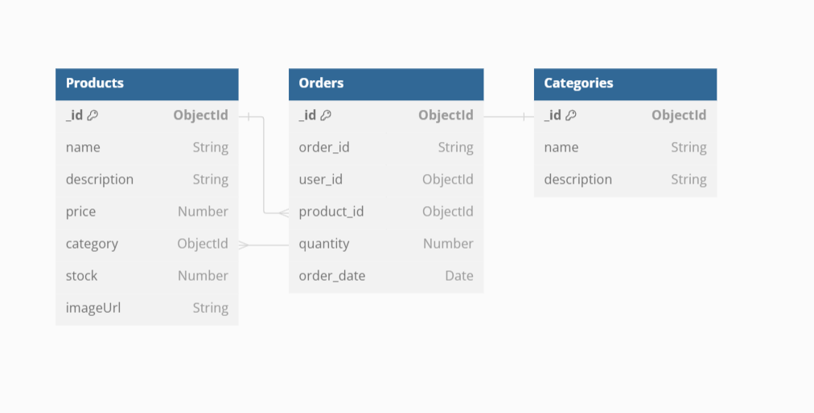

# **E-Commerce Project using MERN**

**Student Name:** Ankit Hiteshkumar Dave

**Student Number:** 8959634

**Date:** 07/19/2024

------------------------------------------------------------------------------------

# Technology Stack

**Frontend:** ReactJS  
**Backend:** Node.js with Express  
**Database:** MongoDB (Atlas)

-------------------------------------------------------------------------------------

# Database Schema Design

## Products Schema (MongoDB)
- `name: String`
- `description: String`
- `price: Number`
- `category: ObjectId`
- `stock: Number`
- `imageUrl: String`

## Categories Schema (MongoDB)
- `name: String`

-------------------------------------------------------------------------------------

# AD's WatchStore

AD's WatchStore is an e-commerce platform for browsing and purchasing watches. The project is built using React and includes various components for different pages and functionalities.

## Prerequisites

- Node.js
- npm
- MongoDB Atlas account

## Installation

1. Clone the repository:
   \`\`\`bash
   git clone https://github.com/ankitdave677/ecommerce-project
   \`\`\`
2. Navigate to the project directory:
   \`\`\`bash
   cd backend
   \`\`\`
   Navigate to the project directory:
   \`\`\`bash
   cd frontend
   \`\`\`
3. Install the dependencies in both the project directory:
   \`\`\`bash
   npm install
   \`\`\`

---------------------------------------------------------------------------------------------------------------------------------------

### Environment Variables

## Create a .env file in the backend directory and add the following environment variables:

\`\`\`
MONGO_URI=your_mongodb_atlas_connection_string
PORT=5000
\`\`\`

---------------------------------------------------------------------------------------------------------------------------------------

## Usage

1. Start the development server:
   \`\`\`bash
   npm start
   \`\`\`
2. Open your browser and go to \`http://localhost:3000\`.

---------------------------------------------------------------------------------------------------------------------------------------

### Frontend Structure

- \`HomePage.js\`: Displays the homepage of the watch store.
- \`CategoryPage.js\`: Displays a list of categories. Each category links to a list of products.
- \`ProductDetail.js\`: Displays detailed information about a specific product.
- \`ProductList.js\`: Displays a list of products in a selected category.
- \`Cart.js\`: Displays the items in the shopping cart.
- \`CheckoutPage.js\`: Displays the checkout form for users to enter their shipping and payment information.
- \`ThankYouPage.js\`: Displays an order confirmation message along with the order details.
- \`NavBar.js\`: Displays the navigation bar with links to Home, Shop, and Cart.
- \`Footer.js\`: Displays the footer of the website.
- \`AdminLogin.js\`: Allows admin to login using credentials.
- \`AdminDashboard.js\`: Admin can view, add, edit, and delete products and categories.

---------------------------------------------------------------------------------------------------------------------------------------

# GitHub Repository

**GitHub Repo Link:** [ecommerce-project](https://github.com/ankitdave677/ecommerce-project)

--------------------------------------------------------------------------------------

# Visual Representation of Database Schema

---------------------------------------------------------------------------------------------------------------------------------------
