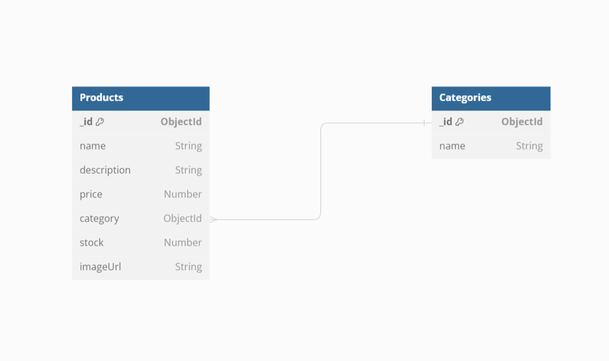

# **E-Commerce Project using MERN**

**Student Name:** Ankit Hiteshkumar Dave

**Student Number:** 8959634

**Date:** 07/19/2024

------------------------------------------------------------------------------------

# Technology Stack

**Frontend:** ReactJS  
**Backend:** Node.js with Express  
**Database:** MongoDB (Atlas)

-------------------------------------------------------------------------------------

# Database Schema Design

## Products Schema (MongoDB)
- `name: String`
- `description: String`
- `price: Number`
- `category: ObjectId`
- `stock: Number`
- `imageUrl: String`

## Orders Schema (MongoDB)
- `order_id: String`
- `user_id: String`
- `product_id: String`
- `quantity: Number`
- `order_date: Date`

## Categories Schema (MongoDB)
- `name: String`
- `description: String`
-------------------------------------------------------------------------------------

# GitHub Repository

**GitHub Repo Link:** https://github.com/ankitdave677/ecommerce-project
--------------------------------------------------------------------------------------

# Visual Representation of Database Schema
